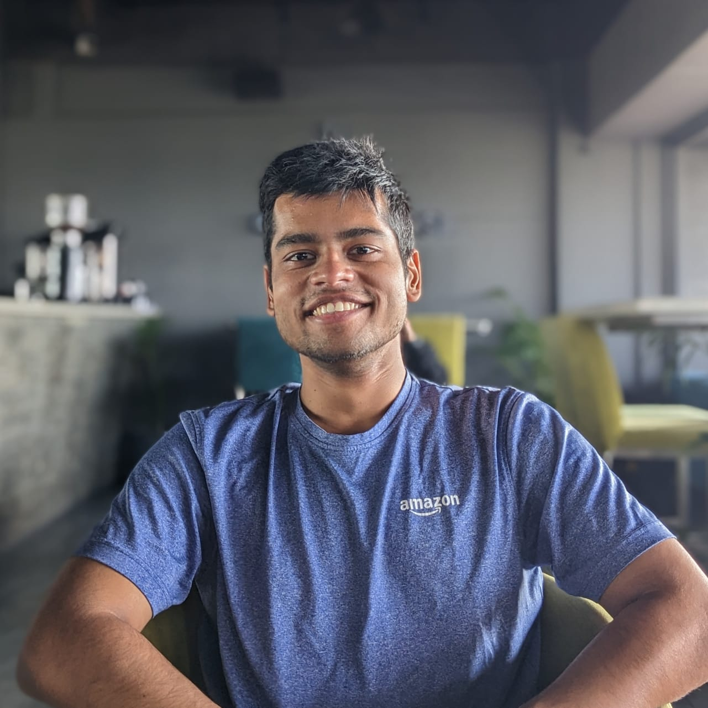

# Speakers

    

        

        

<b>Nanyun (Violet) Peng</b> UCLA

    

    

        

        

<b>He He</b> NYU

    

    

        

        

<b>Tuhin Chakrabarty</b> Columbia

    

    

        

        

<b>Vishakh Padmakumar</b> NYU

    

  

# Overview

- **Date**: December 6, 2023
- **Duration**: 2pm - 5pm (3 hrs)
- **Location**: Pisces 2&3
- **EMNLP Page**: [Miniconf](https://virtual2023.emnlp.org/tutorial_t6.html)

Large language models such as GPT-3, GPT-4, Claude etc., have advanced the state-of-the-art in several natural language generation tasks such as text summarization and machine translation. However, when it comes to open-ended tasks with a focus on creativity such as generating stories, poetry, or various forms of figurative language, these state-of-the-art language models are often found to be inadequate.This tutorial aims to bring awareness of the important and emerging research area of open-domain creative generation, with a focus on language generation while also touching on multi-modal generation (e.g., image captioning, visual metaphors). It targets natural language processing (NLP) and artificial intelligence (AI) researchers as well as creative writing practitioners who are interested in building systems that are capable of emulating as well as augmenting human creativity. In particular, we will review recent studies on creative language generation both at the sentence level as well as longer forms of text. We will provide the audiences with a holistic view of 1) the importance and challenges of building creative language generation systems; 2) how we incorporate content planning, domain knowledge, and creativity-specific heuristics for different forms of creative language generation such as story, poetry, humor, metaphors, etc. 3) how can we build better evaluation methods for creative text generation in standalone as well as interactive settings? In particular, how could the recent advancement of AI shape the future workforce for creativity? We will conclude the tutorial by outlining future research directions in this area.

**Click on each chapter to view the reading lists:** 

Overview and Historical Perspective of Creativity in NLP

TALESPIN
     
    <a target="_blank" href="https://www.ijcai.org/Proceedings/77-1/Papers/013.pdf">TALE-SPIN, AN INTERACTIVE PROGRAM THAT WRITES STORIES </a>Meehan et al (1977)</li>
     
    <a target="_blank" href="https://www.ijcai.org/Proceedings/81-1/Papers/004.pdf">STORY GENERATION AFTER TALE-SPIN </a>Dehn et al (1981)</li>
     
POETICS
    <a target="_blank" href="https://www.sciencedirect.com/science/article/abs/pii/0304422X84900019">Creating characters in a story-telling universe</a>Lebowitz et al (1984) 
    <a target="_blank" href="https://era.ed.ac.uk/bitstream/handle/1842/3461/0016.pdf?sequence=1&isAllowed=y">A Flexible Integrated Architecture For Generating Poetic Texts</a>Manurung et al (2000) 
PRAGMATICS
    <a target="_blank" href="https://www.sciencedirect.com/science/article/abs/pii/0378216687901093">Generating natural language under pragmatic constraints
    </a>Hovy et al (1987) 
    <a target="_blank" href="https://aclanthology.org/P05-3029.pdf">HAHAcronym: A Computational Humor System</a>Stock et al (2005) 

 

Content Planning

 
PLAN AND WRITE
    <a target="_blank" href="https://vnpeng.net/bibliography/yao2019plan/">Plan-And-Write: Towards Better Automatic Storytelling
    </a>Yao et al (2019)</li>
     
    <a target="_blank" href="https://aclanthology.org/P19-1254/">Strategies for Structuring Story Generation</a>Fan et al (2019)</li>
     
    <a target="_blank" href="https://ojs.aaai.org/index.php/AAAI/article/view/11430">Event Representations for Automated Story Generation with Deep Neural Nets
    </a>Martin et al (2018)</li>
IMPROVE PLAN AND THEN WRITE
     
    <a target="_blank" href="https://aclanthology.org/2020.emnlp-main.351.pdf">Content Planning for Neural Story Generation with Aristotelian Rescoring</a>Goldfarb-Tarrant et al (2020)</li>
PLAN AND WRITE BY PROMPTING LLMS
    <a target="_blank" href="https://aclanthology.org/2022.emnlp-main.296/">Re3: Generating Longer Stories With Recursive Reprompting and Revision</a>Yang et al (2022)</li>
    <a target="_blank" href="https://aclanthology.org/2023.acl-long.190/">DOC: Improving Long Story Coherence With Detailed Outline Control</a>Yang et al (2023)</li>
     

